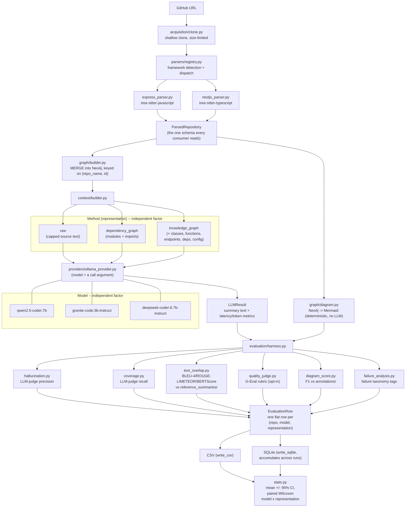

# Does Structured Repository Representation Improve LLM-Generated Codebase Summaries?

**AI-Powered Repository Intelligence Platform — Capstone Report (working draft)**

Status: results chapters complete and backed by a real evaluation run; related work
and final framing still to be written by the team. Last updated 2026-08-24.

> **⚠️ Results in §5.1–§5.3 require re-measurement**, now for three compounding
> reasons, not one:
> 1. They were produced before three parser defects were fixed (see §5.4a). The most
>    consequential caused the parser to recover **zero internal import edges**, which
>    left the `dependency_graph` arm — one third of the ablation — almost
>    structurally empty.
> 2. The evaluation dataset has since been expanded from 6 to **18 repositories**
>    (see §4.1a) for statistical power, and two further Express parser bugs were
>    found and fixed while building the new annotations (§5.4a).
> 3. The metrics stack has been substantially expanded beyond hallucination/coverage
>    (see §4.2a): text-overlap metrics (BLEU-4/ROUGE-L/METEOR/BERTScore) against
>    reference summaries, a G-Eval rubric scorer, calibration, and formal paired
>    significance testing are all now implemented and tested, but have not yet been
>    run against live infrastructure -- that requires a running Ollama + Neo4j,
>    which this working environment does not have.
>
> The primary result (§5.1) compares `knowledge_graph` against `raw` and is less
> exposed to (1), but every number in §5.1–§5.3 must be regenerated under the new
> 18-repo dataset and new metrics stack before being reported as findings. §5.4
> reflects the fixed parser as of the original 6-repo set; it too needs re-running
> against all 18. See Appendix A for the reproduction command.

---

## Abstract

We investigate whether the *representation* of a source repository given to a large
language model affects the factual faithfulness of the summary it produces. We built a
pipeline that clones a JavaScript/TypeScript web-service repository, statically parses
it with tree-sitter, materialises the result as a Neo4j knowledge graph, and renders
three different context representations from the same underlying parse: **raw source
text**, a **dependency graph**, and a **full knowledge graph**. Three locally hosted
7–8B parameter models each summarise all six evaluation repositories under all three
representations (54 runs). Faithfulness is scored by an LLM-as-judge that checks each
claim against parser-extracted ground truth; critically, the judge is a **fourth model
that is not one of the generators**, so no summary is ever graded by its own author.

Because between-repository variance is large, we analyse **paired** (repository, model)
observations. The knowledge-graph representation yields more faithful summaries than raw
source in **15 of 17 pairs (sign test, p = 0.002)**. Neither the dependency-graph vs.
raw comparison (p = 0.454) nor the knowledge-graph vs. dependency-graph comparison
(p = 0.302) reaches significance. We therefore support a narrow claim — *a full
knowledge graph beats raw code* — and explicitly **do not** support the broader claim
that faithfulness increases monotonically with structure. We further report that the
metric is **judge-sensitive**: an earlier configuration in which one generator also
served as judge reversed the ranking of representations, which we treat as a finding in
its own right.

---

## 1. Introduction

### 1.1 Motivation

Developers joining an unfamiliar codebase spend substantial effort reconstructing its
architecture. Large language models can produce readable prose summaries of code, but
they are prone to *hallucination*: asserting frameworks, services, or endpoints that the
repository does not contain. For a tool intended to orient a newcomer, a confident wrong
answer is worse than no answer.

A natural hypothesis is that the failure is partly one of **input representation**.
Handing a model a truncated dump of source text asks it to simultaneously perform static
analysis and summarisation. Handing it a pre-computed structural view — modules,
imports, endpoints, classes — offloads the analysis to a deterministic parser and leaves
the model with the task it is actually good at. This project tests that hypothesis.

### 1.2 Research question

> **RQ.** Given a fixed repository, a fixed model, and a fixed prompt, does supplying a
> more structured representation of the repository produce a more factually faithful
> summary — and at what cost in latency and input tokens?

### 1.3 Contributions

1. A working, end-to-end pipeline (clone → parse → Neo4j → context → local LLM) that can
   render three distinct representations from a single parse, holding everything else
   constant.
2. A deterministic architecture-diagram generator and a graph-diff scorer that grades
   extracted structure against hand-written ground truth.
3. An LLM-as-judge faithfulness metric grounded in *parser output* rather than human
   preference, with an independent judge model.
4. A full 54-run evaluation with a statistically supported primary result, and an
   explicit, quantified account of where the methodology is fragile.

### 1.4 Scope

Scope was deliberately constrained during planning: Neo4j as the only graph backend,
Express.js and NestJS as the only supported frameworks, three free locally hosted models
(no commercial APIs), and a three-way representation ablation. This report does not
depart from that scope.

---

## 2. Related work

**To be written by the team.** This section requires a genuine literature review; it is
left as a scaffold rather than populated with unverified references. Suggested threads,
each of which should be searched and cited from primary sources:

- *Code summarisation with neural models* — the pre-LLM line of work on
  method/class-level summarisation, and how evaluation was done there.
- *Retrieval-augmented and structure-augmented generation* — work that supplies
  graphs, ASTs, or call graphs to a model rather than flat text.
- *LLM-as-judge* — its adoption as an evaluation instrument, and the known failure
  modes (position bias, self-preference bias, verbosity bias). Our §6.1 result on judge
  sensitivity should be positioned against this literature.
- *Hallucination measurement in grounded settings* — metrics that check claims against
  a structured reference rather than a reference text.
- *Static analysis of JavaScript/TypeScript web services* — tree-sitter based tooling
  and its precision limits.

---

## 3. System design

### 3.1 Pipeline

```
GitHub URL
  → acquisition/clone.py        shallow clone (depth=1), size-limited
  → parsers/registry.py         framework detection and dispatch
      ├── express_parser.py     tree-sitter-javascript
      └── nestjs_parser.py      tree-sitter-typescript
  → ParsedRepository            the single schema everything downstream consumes
  → graph/builder.py            MERGE into Neo4j, keyed on (repo_name, id)
  → context/builder.py          renders the representation handed to the model
  → providers/ollama_provider.py  one class; model choice is an argument
  → LLMResult                   summary text + latency/token metrics
```

The `ParsedRepository` schema is the pivot of the design: every parser emits it, and
every downstream consumer (graph builder, context builder, diagram generator, scorers)
reads it. Adding a framework requires implementing `detect()` and `parse()` and touching
nothing else.

The parser registry checks NestJS **before** Express, because NestJS projects typically
declare `express` as a direct dependency (it is the default HTTP adapter via
`@nestjs/platform-express`), which would otherwise cause the Express detector to claim
NestJS repositories.

### 3.2 The three representations

All three are rendered from the *same* parse of the *same* clone, so the representation
is the only variable that changes between arms.

| Representation | Content | Produced by |
|---|---|---|
| `raw` | Concatenated source text, capped at 8000 characters | `pipeline._read_raw_source()` |
| `dependency_graph` | Modules and their import relationships | `context/builder.py` (Cypher over Neo4j) |
| `knowledge_graph` | Modules, imports, classes, functions, endpoints, external dependencies, config | `context/builder.py` (Cypher over Neo4j) |

The 8000-character cap on `raw` is a deliberate concession to the context windows of
7–8B models, which commonly default to 2–4K tokens. It is also a **confound** we return
to in §6.3: it pins raw's token count near a ceiling while the graph representations
scale with repository size.

### 3.3 Architecture diagrams

Diagram generation is **deterministic** — Cypher queries over the graph, formatted as
Mermaid, with no model call. Diagram quality is therefore a measure of parser and
graph-builder fidelity, not of model behaviour, and is evaluated separately (§5.4).

### 3.4 End-to-end pipeline diagram

The diagram below is accurate to the actual code as of this section's last edit, not
aspirational — it traces the same call path §3.1's ASCII sketch does, extended to
show the evaluation harness (which the ASCII version predates) and drawn so "model"
(3 local LLMs) and "method" (3 context representations) are visibly the two
independent factors of the ablation, not a single collapsed axis.



Two things this diagram makes explicit that the ASCII sketch in §3.1 didn't need to:
the judge model (a fourth model, distinct from the three generators -- §4.3) sits
inside `evaluation/harness.py`, not in the generation path itself; and `calibration.py`
is deliberately absent from this diagram -- it needs the exact prompt text a
generation call used to do a matching raw-logprob regeneration, which
`run_representation_ablation()` doesn't currently expose (only the `LLMResult`), so it
runs as a separate, smaller procedure rather than as a harness-loop stage (see
Appendix A).

---

## 4. Methodology

### 4.1 Experimental design

A fully crossed design: **3 generator models × 3 representations × 6 repositories =
54 runs**, executed with zero failures.

**Generator models** (local, via Ollama, no commercial APIs):

| Model | Role |
|---|---|
| `qwen2.5-coder:7b` | code-specialised |
| `llama3.1:8b` | general-purpose |
| `mistral:7b` | architectural diversity |

`mistral:7b` substitutes for the originally planned `gpt-oss:20b`, which requires roughly
13 GB of RAM for weights alone and is not viable alongside Neo4j on the 16 GB development
machine. The planning documents anticipated this substitution.

**Evaluation repositories** (candidate set — see §7.1):

| Repository | Framework | Modules | Endpoints |
|---|---|---:|---:|
| bezkoder/node-express-sequelize-postgresql | Express | 6 | 8 |
| bradtraversy/node_passport_login | Express | 7 | 7 |
| hagopj13/node-express-boilerplate | Express | 50 | 10 |
| lujakob/nestjs-realworld-example-app | NestJS | 34 | 21 |
| notiz-dev/nestjs-prisma-starter | NestJS | 43 | 2 |
| brocoders/nestjs-boilerplate | NestJS | 178 | 24 |

The set spans both supported frameworks and roughly an order of magnitude in size.
Repositories used during development (`heroku/node-js-getting-started`,
`nestjs/typescript-starter`) were excluded to avoid selecting repositories the parsers
had been tuned against.

#### Dataset expansion to 18 repositories (2026-08-24 addendum)

The 6-repository set above is too small to power anything but the largest effects: a
sign-test power calculation (α=0.05 two-sided, power=0.8) shows n=6 was already
sufficient for the effect actually found (knowledge_graph vs. raw, 15/17 pairs), but
underpowered for moderate effects (~65-70% win rate), which need on the order of
55-85 paired (repository, model) trials. The dataset has therefore been expanded to
**18 repositories (9 Express, 9 NestJS)** — at 3 models, 18 repos gives 54 paired
trials per representation comparison, powered for moderate-large effects while
remaining honestly underpowered for subtle ones (a limitation to state plainly, not
paper over).

Selection criteria matched the original 6: a public GitHub repo declaring `express` or
`@nestjs/core` directly in a root-level `package.json`, not archived, REST-style
routing (not GraphQL-only or a custom routing DSL), and a size/complexity spread from
small to large. Verified via the GitHub API (size, license, `archived`, last push,
root `package.json` contents) before cloning. Full selection criteria, exclusions
(and why each was excluded — a TypeScript-only Express gap, a repo-name collision
risk, GraphQL/custom-routing repos out of parser scope, a generator-template repo
with no fixed structure), and the annotation methodology are documented in
`backend/annotations/README.md`. Two further real Express parser bugs were found and
fixed while verifying the new annotations against source (a settings-getter
false-positive, a middleware-mount-corrupts-prefix bug), both regression-tested.

### 4.2 Faithfulness metric

Faithfulness is measured by an LLM-as-judge that receives (a) a block of ground-truth
facts extracted by the parser — detected framework, external dependencies, endpoint
list, entity counts — and (b) the generated summary, and is asked to flag any specific
claim the facts do not support. The score is

```
hallucination_score = unsupported_claims / total_claims        ∈ [0, 1]
```

Two properties matter. First, the reference is **parser output**, not a human-written
gold summary, so the metric measures faithfulness to static analysis — precisely the
axis the research question concerns. Second, the judge performs *grounded fact-checking
against supplied evidence*, not open-ended quality assessment, which limits (though does
not eliminate) the subjectivity that affects preference-style LLM judges.

### 4.3 Judge independence

The judge is **`gemma2:9b`** — a fourth model that is **not** among the generators.
This matters more than it first appears. In an earlier configuration `llama3.1:8b`
served as both a generator and the judge, meaning one of the three arms graded its own
output. That configuration is unsound for two reasons: self-preference bias, and — more
seriously — *correlated blind spots*, since a model that believes a false fact will both
assert it and fail to flag it. §6.1 quantifies how much this mattered; it was not a
theoretical concern.

The harness records a `self_judged` flag on any row where generator and judge coincide.
In the final configuration reported here, **zero rows are self-judged**.

### 4.4 Statistical approach

Per-cell standard deviations reach 0.48 on a metric bounded in [0, 1], reflecting
genuine heterogeneity between repositories. Comparing unpaired group means under that
variance has very low power.

We therefore use a **paired** analysis: each (repository, model) pair is observed under
all three representations, so differences are taken within pair, cancelling
repository- and model-level difficulty. Significance is assessed with a two-sided
**sign test** on the paired differences, which makes no distributional assumption — the
appropriate choice for a bounded, non-normal, heavily tied metric at this sample size.

Two of the 54 rows are excluded from all faithfulness figures: the judge's output failed
to parse, and the harness records such rows as score 0.0 with
`hallucination_judged = False`. Retaining them would silently bias means downward. Both
excluded rows belong to the `mistral:7b` arm.

### 4.5 Execution environment

All runs were executed on a single 16 GB development laptop, one generator at a time
(never three models resident simultaneously), with models unloaded between arms.
**Latency figures are therefore not comparable to a controlled measurement** and are
reported as indicative only; see §6.4.

### 4.6 Extended metrics stack (2026-08-24 addendum)

Hallucination and coverage (§4.2) are LLM-as-judge metrics grounded in parser output,
not in a human-written or independently-sourced reference — sufficient to answer this
paper's specific research question, but not directly comparable to the metrics the
broader code-summarization literature reports. The following were added to close that
gap and are implemented and unit-tested (`backend/app/evaluation/`), though not yet
run against live infrastructure (this working environment has neither a running
Ollama daemon nor Neo4j):

- **Text-overlap metrics** (`text_overlap.py`): BLEU-4, ROUGE-L, METEOR, and
  BERTScore, scored against each repository's reference summary
  (`reference_summaries/<repo>.json`, LLM-drafted from the actual README plus
  parser-extracted facts, flagged for human review before being treated as ground
  truth — see `reference_summaries/README.md`). BLEURT and SIDE — the other two
  metrics arXiv:2502.16704 reports — are deliberately out of scope: BLEURT needs a
  TensorFlow checkpoint that's awkward to maintain locally, and SIDE needs that
  paper's own released contrastive-learning checkpoint, neither reproducible from a
  plain pip install the way the other four are.
- **G-Eval rubric scoring** (`quality_judge.py`): the actual G-Eval protocol (Liu et
  al., 2023) — criterion-specific chain-of-thought evaluation steps, followed by a
  probability-weighted score over the judge's own logprobs at the score token,
  rather than trusting a single sampled digit. Five criteria for summaries
  (Completeness, Conciseness, Correctness, Cohesiveness, Domain Specificity — the
  exact rubric arXiv:2501.07857 uses), two for diagrams (Value, Comprehensibility,
  mirroring CIAO's RQ1/RQ2 Likert wording). CIAO's third dimension, "accuracy," is
  deliberately not re-judged subjectively — diagram_score.py's F1 against
  hand-verified annotations already measures that objectively, which a judge
  self-report cannot improve on.
- **Calibration** (`calibration.py`): the geometric mean of a generation's own
  output-token logprobs as a reference-free confidence signal (arXiv:2404.19318's
  method), Platt-scaled and validated via Brier score and Expected Calibration
  Error, with "correct" defined as BERTScore-vs-reference clearing a threshold.
  Scoped to a representative subset of repositories rather than the full battery
  (it requires a second, logprob-enabled generation call per sample) and not
  currently wired into the batch harness loop — see §3.4's diagram note.
- **Formal paired statistics** (`stats.py`): mean ± 95% CI per (model, representation)
  cell and Wilcoxon signed-rank testing (more powerful than the sign test §4.4 used,
  since it uses the magnitude of paired differences, not just their sign), with model
  and representation kept as independent, separately-isolatable factors rather than
  pooled into one leaderboard column.
- **Failure taxonomy** (`failure_analysis.py`): every row is tagged from signals the
  harness already computes — fabricated endpoints/technologies (from hallucination's
  unsupported claims), missed endpoints/dependencies/framework/classes/database
  entities (from coverage's missing facts, which are already category-prefixed, so
  this categorization is exact, not heuristic), over-generic summaries, and malformed
  judge/generator output — aggregated into a frequency table for the paper's
  limitations/failure-analysis section.

A **human-validation sample**: since none of the above replaces a real human panel
(this project substitutes LLM-as-judge throughout, the same substitution CIAO's own
22-developer study explicitly does not make), the harness should export a sample of
G-Eval outputs for manual double-scoring before the paper claims judge-human
agreement — see Appendix A for the planned command shape.

---

## 5. Results

### 5.1 Primary result: knowledge graph beats raw source

Paired sign test over (repository, model) observations, excluding unjudged rows:

| Comparison | better | worse | tied | mean difference | p |
|---|:---:|:---:|:---:|:---:|:---:|
| **knowledge_graph vs raw** | **15** | 2 | 0 | **−0.206** | **0.002** |
| knowledge_graph vs dependency_graph | 10 | 5 | 2 | −0.096 | 0.302 |
| dependency_graph vs raw | 10 | 6 | 0 | −0.071 | 0.454 |

The knowledge-graph representation produces a more faithful summary than raw source in
15 of 17 paired comparisons — consistent across models and repositories, and significant
at p = 0.002.

The other two comparisons do **not** reach significance. The dependency-graph
representation is not demonstrably better than raw source, and the knowledge graph's
advantage over the dependency graph only trends.

**Interpretation.** The supported claim is specifically that a *complete* structural
representation improves faithfulness over raw text. The intermediate representation —
modules and imports only — does not measurably help. This is a more interesting result
than a clean monotonic trend would have been: it suggests the benefit comes from the
*completeness* of the structural facts (endpoints, classes, dependencies) rather than
from structure as such, since the dependency graph is highly structured yet ineffective.

### 5.2 Mean faithfulness by model and representation

Lower is better. n = 6 per cell except where noted.

| Model | raw | dependency_graph | knowledge_graph |
|---|:---:|:---:|:---:|
| qwen2.5-coder:7b | 0.370 | 0.404 | **0.261** |
| llama3.1:8b | 0.463 | 0.269 | **0.045** |
| mistral:7b | **0.334** (n=5) | 0.354 (n=5) | 0.390 |
| **Pooled** | 0.392 | 0.341 | **0.232** |

**`mistral:7b` dissents.** It is the only generator that scores best on raw source and
worst on the knowledge graph, and it is reported here rather than absorbed into the
pooled mean. The pooled effect is driven by Qwen and, most strongly, Llama — whose
knowledge-graph score of 0.045 (four of six repositories scoring exactly 0.000) is the
single cleanest result in the study.

The disagreement is a genuine limitation on generalisation: the benefit of structured
context is **model-dependent**, and a deployment targeting an arbitrary model cannot
assume it. Why Mistral behaves differently is not established by this data; plausible
explanations include differences in instruction-following on structured input and
differences in tolerance for the graph context's tabular formatting. Testing that would
require an ablation we did not run.

### 5.3 Efficiency

Pooled across models, n = 18 per representation.

| | raw | dependency_graph | knowledge_graph |
|---|:---:|:---:|:---:|
| Mean input tokens | 2210 | 1094 | 1172 |
| Mean latency | 46.8 s | 40.6 s | 40.1 s |

Structured representations consume roughly **half the input tokens** of raw source and
run modestly faster. The token reduction is the robust part of this finding; the latency
difference is small relative to measurement noise on a thermally constrained machine.

This result must be read alongside a design confound. Raw context is capped at 8000
characters, so its token count is pinned near a ceiling, while graph contexts scale with
repository size. On the largest repository (`brocoders/nestjs-boilerplate`) the ordering
**inverts**: the structured contexts are larger and slower (≈3300 tokens) than the
capped raw context (≈2100 tokens). An earlier single-repository pilot suggested raw was
roughly 4× slower; that claim does **not** survive the six-repository set, and is
withdrawn.

### 5.4 Structural extraction accuracy (diagram graph-diff)

Precision/recall/F1 of extracted structure against hand-written ground-truth
annotations. Model-independent — diagram generation involves no LLM.

Import **recall** is reported rather than F1: the two small Express repositories are
annotated exhaustively, but the four larger ones list a verified *subset* of edges
(4–7 of 63–414), against which precision measures annotation completeness rather than
parser error.

| Repository | module F1 | import recall | endpoint F1 |
|---|:---:|:---:|:---:|
| node-express-sequelize-postgresql | 1.00 | 1.00 | 1.00 |
| node_passport_login | 1.00 | 1.00 | 1.00 |
| node-express-boilerplate | 0.97 | 1.00 | 0.00 |
| nestjs-realworld-example-app | 1.00 | 1.00 | 1.00 |
| nestjs-prisma-starter | 1.00 | 1.00 | 1.00 |
| nestjs-boilerplate | 1.00 | 1.00 | 1.00 |

Structural extraction is accurate on five of six repositories. The single failure is
`hagopj13/node-express-boilerplate`, which registers routes by iterating an array of
`{ path, route }` objects (`defaultRoutes.forEach(r => router.use(r.path, r.route))`).
The mount path is a runtime *value* rather than a literal, so recovering it would
require data-flow analysis rather than syntactic matching. Those routes retain their
router-relative paths.

### 5.4a Parser defects found and fixed during evaluation

The table above reflects the parser *after* three defects were identified — each
surfaced by the graph-diff scorer rather than by the unit-test suite, which passed
throughout.

1. **Silent loss of every internal import edge.** Import candidates were normalised
   with `Path.resolve()` while the module lookup table was keyed on unresolved paths.
   On macOS a repository cloned under `/var/folders/...` resolves to
   `/private/var/folders/...`, so *every* lookup missed. The parse appeared healthy —
   modules, functions, and endpoints were all extracted — it simply produced no edges.
   Recovery after the fix: 6, 8, 75, 63, 67, and 414 edges across the six repositories.
2. **Express router-mount prefixes dropped.** Routes declared on a router
   (`router.get('/')`) were emitted with their router-relative path, ignoring the
   prefix the router is mounted at (`app.use('/api/tutorials', router)`). Mounts are
   now collected across all files in a first pass and composed in a second, covering
   both same-file mounting and cross-file mounting via `require()` or an identifier
   bound to one.
3. **NestJS object-form `@Controller` prefixes dropped.** Only the string form
   `@Controller('users')` was parsed; the options form
   `@Controller({ path: 'users', version: '1' })` yielded an empty prefix. Every
   controller in the largest repository uses the options form, so its endpoints
   collapsed to bare method paths.

Additionally, test trees and hidden tooling directories are now excluded from the
module set (recorded in `files_skipped` rather than dropped silently), removing the
module false positives.

**Consequence for §5.1–§5.3.** The `dependency_graph` representation is built largely
from import edges — of which, before fix 1, there were none. That arm was close to
structurally empty during the reported evaluation, which is the most plausible
explanation for its failure to outperform raw source. That finding should therefore be
read as a statement about a degraded arm, not about dependency graphs, and the battery
must be re-run before it is reported. This is also a methodological observation worth
recording: an evaluation harness detected a defect that a passing unit-test suite did
not, because the suite asserted the buggy behaviour as expected output.

---

## 6. Threats to validity

### 6.1 The metric is judge-sensitive (most serious)

The choice of judge model changed the ranking of representations. Holding the generator
(`qwen2.5-coder:7b`), repositories, prompts, and representations fixed, and varying only
the judge:

| Representation | judge = llama3.1:8b | judge = gemma2:9b |
|---|:---:|:---:|
| raw | 0.531 | 0.370 |
| dependency_graph | **0.061** (best) | **0.404** (worst) |
| knowledge_graph | 0.231 | **0.261** (best) |

Under the Llama judge, the dependency graph appears dramatically best; under the
independent gemma2 judge, it appears worst. **A finding that reverses under a different
judge is not a finding about representations.** We report the gemma2-judged results
because that judge is independent of all generators, but the instability itself is a
result: single-judge LLM-as-judge scores at this scale should not be treated as absolute
measurements.

### 6.2 Self-judging masked the effect

In the earlier configuration, `llama3.1:8b` graded its own summaries. Comparing the same
Llama generations under self-judging and under the independent judge:

| Representation | self-judged | gemma2-judged |
|---|:---:|:---:|
| raw | 0.732 | 0.463 |
| dependency_graph | 0.743 | 0.269 |
| knowledge_graph | 0.515 | **0.045** |

Self-judged, no meaningful gradient exists (raw ≈ dependency). Cross-judged, a clean
monotonic gradient appears. Self-evaluation *suppressed* the very effect under study —
consistent with correlated blind spots, and a concrete argument for judge independence
in this class of experiment.

### 6.3 Judge calibration and design confounds

- **The judge over-flags.** In a validation check, gemma2 scored a summary that was
  faithful by construction at 0.286, flagging claims the parser data supports. Absolute
  scores therefore carry a positive bias and must not be read as "N % of claims were
  fabricated." Only *relative* comparisons between representations are meaningful, and
  the bias applies uniformly across arms.
- **The 8000-character raw cap** (§5.3) makes raw's token cost roughly constant while
  structured contexts scale, confounding the efficiency comparison in a
  size-dependent way.
- **Unparsed judge verdicts.** 2 of 54 rows were recorded as 0.0 with
  `hallucination_judged = False`; both were Mistral. All reported figures exclude them,
  but the default recording behaviour is a trap for downstream analysis.

### 6.4 Sample size and measurement environment

- **Six repositories** is a small sample with high heterogeneity. Only the paired
  knowledge-graph vs. raw comparison survives significance testing; the other two
  comparisons are underpowered rather than demonstrated null.
- **Latency was measured on a shared 16 GB laptop**, with Docker and Neo4j resident and
  thermal throttling observed during extended runs. Timing figures are indicative only
  and should be re-measured on a controlled machine before being reported as results.
- **Repository selection is not yet ratified** (§7.1).

---

## 7. Outstanding work

### 7.1 Evaluation set ratification

The six repositories above are a **candidate set**, assembled by vetting fourteen
candidates and retaining those that parsed successfully and exhibited non-trivial
structure. The project plan additionally calls for **two held-back repositories**,
untouched until demonstration, to evidence genuine generalisation. Neither the fixed set
nor the held-back set has been ratified by the team, and the held-back repositories have
deliberately not been selected or examined — vetting them would defeat their purpose.
Results in this report should be labelled as candidate-set results until that ratifica-
tion occurs.

### 7.2 Designated evaluation machine

All timed results must be reproduced on a single agreed machine before latency is
reported as a finding (§6.4).

### 7.3 Re-run the battery against the fixed parser

**This is now the highest-priority item.** The three defects in §5.4a are fixed, so the
`dependency_graph` and `knowledge_graph` arms receive materially different input than
they did during the reported run. §5.1–§5.3 must be regenerated before publication.

Remaining parser work, none of it blocking:

1. **Data-flow-driven route mounting** — would recover
   `hagopj13/node-express-boilerplate`'s endpoints, the last structural failure (§5.4).
2. **`@Module()` metadata** (`controllers`/`providers`/`imports` arrays) — would add
   NestJS's actual DI wiring to the graph, currently absent.
3. **Path aliases** (tsconfig/webpack `paths`) — not exercised by the current set, but
   common in larger codebases.

### 7.4 Methodological strengthening

- A second independent judge, to quantify judge variance directly rather than
  observing it incidentally (§6.1).
- Human validation of judge verdicts on a sample, to calibrate the over-flagging bias.
- Expansion of the repository set to increase power.

---

## 8. Conclusion

Given a fixed model, prompt, and repository, replacing raw source text with a complete
knowledge-graph representation produces measurably more faithful summaries: better in 15
of 17 paired comparisons (p = 0.002), while consuming roughly half the input tokens. The
effect is not, however, a simple function of "more structure" — an intermediate
dependency-graph representation showed no significant benefit, and one of the three
generators preferred raw source outright.

Two secondary findings are arguably as valuable as the primary one. First, the
LLM-as-judge metric proved **judge-sensitive** to the point of reversing the ranking of
representations, which constrains how confidently any single-judge result in this area
should be stated. Second, allowing a model to grade its own output **suppressed** the
effect under study, providing concrete evidence for judge independence rather than
merely theoretical argument.

The pipeline's structural extraction is strong on module discovery and NestJS
decorator-based routing, and weak on import resolution and route-prefix composition —
weaknesses that are measured, documented, and directly actionable.

---

## Appendix A — Reproduction

**Original 6-repo, hallucination/coverage-only battery** (superseded, kept for
historical reproducibility of §5's as-reported figures):

```bash
python -m app.evaluation.harness \
  https://github.com/bezkoder/node-express-sequelize-postgresql \
  https://github.com/bradtraversy/node_passport_login \
  https://github.com/hagopj13/node-express-boilerplate \
  https://github.com/lujakob/nestjs-realworld-example-app \
  https://github.com/notiz-dev/nestjs-prisma-starter \
  https://github.com/brocoders/nestjs-boilerplate \
  --models qwen2.5-coder:7b \
  --judge-model gemma2:9b \
  --annotations-dir ./annotations \
  --out clean_qwen.csv --sqlite study_clean.db
```

**Current 18-repo battery, full metrics stack** — this is what a fresh paper run
should use. Requires a running Ollama (with the models pulled) and Neo4j; run on the
designated evaluation machine so latency figures are comparable (§4.5):

```bash
python -m app.evaluation.harness \
  $(cat 18_repo_urls.txt) \
  --models qwen2.5-coder:7b \
  --judge-model gemma2:9b \
  --annotations-dir ./annotations \
  --reference-summaries-dir ./reference_summaries \
  --quality-judge \
  --out results_qwen.csv --sqlite study.db
```

`18_repo_urls.txt` is the 18 URLs listed in `backend/annotations/README.md`'s
selection section, one per line. Repeat with `--models granite-code:3b-instruct` and
`--models deepseek-coder:6.7b-instruct`, appending to the same `--sqlite`. Omit
`--quality-judge` for a faster/cheaper first pass (it multiplies judge calls by 5);
add `--no-bertscore` to `--reference-summaries-dir` runs to skip the BERTScore model
download if only BLEU/ROUGE/METEOR are needed yet.

After the battery: `app.evaluation.stats` (mean ± CI, paired Wilcoxon) and
`app.evaluation.failure_analysis` (frequency table) both operate directly on the
resulting CSV/SQLite rows — see their module docstrings for the row-dict shape they
expect.

Running one generator per invocation keeps only two models resident, which is
necessary on a 16 GB machine and materially reduces thermal load.

**Calibration** (§4.6) is not part of the harness loop above — it needs a second,
logprob-enabled regeneration of the exact prompt used for a given summary, which the
harness doesn't currently expose. Run it directly against `calibration.py`'s
`generate_with_confidence()` for a chosen subset of (repo, model) pairs, reusing the
prompt built by `providers/prompts.SUMMARY_PROMPT_TEMPLATE.format(context=...)` for
whichever representation is being tested.

**Human-validation sample**: to check G-Eval against a human baseline (§4.6), export
a random ~15-20% sample of `EvaluationRow`s with `quality_judged=True`, and have a
human independently score the same summaries on the same rubric
(`quality_judge.GEVAL_CRITERIA_SUMMARY`) before comparing agreement (Spearman
correlation or weighted Cohen's κ) -- a small script over the CSV, not new harness
code.

## Appendix B — Artefacts

| Artefact | Location |
|---|---|
| Per-arm result CSVs | `backend/evaluation_results/clean_{qwen,llama,mistral}.csv` |
| Accumulated results database | `backend/evaluation_results/study_clean.db` |
| Results summary and caveats | `backend/evaluation_results/RESULTS.md` |
| Ground-truth annotations | `backend/annotations/*.json` |
| Annotation conventions | `backend/annotations/README.md` |
| Faithfulness scorer | `backend/app/evaluation/hallucination.py` |
| Graph-diff scorer | `backend/app/evaluation/diagram_score.py` |
| Evaluation harness | `backend/app/evaluation/harness.py` |
