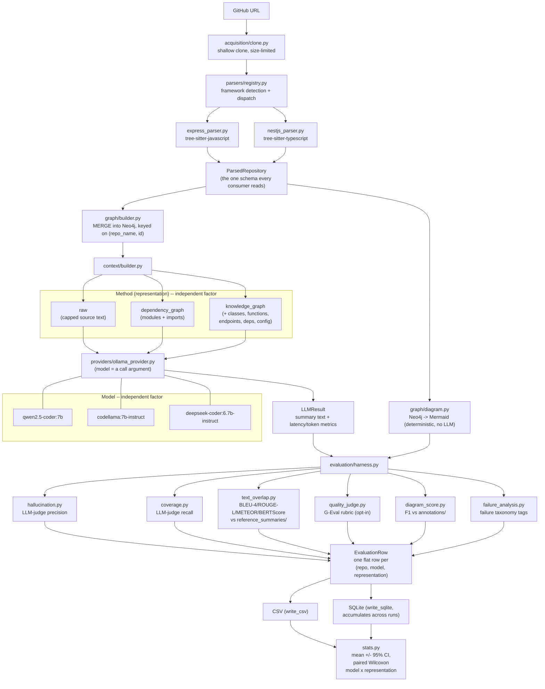

# Grading the Grader: A Parser-Grounded Audit of LLM-as-Judge Coverage Metrics for Repository-Level Code Summarization

**AI-Powered Repository Intelligence Platform — Capstone Report**

Last updated 2026-08-28. Results chapters complete and backed by three independent
measurements of the same 157 summaries: a deterministic oracle and two LLM judges.

> **Reading note.** This report was originally framed around the question *"does
> structured repository representation improve summaries?"* That question is answered
> (§5.7), but it is no longer the primary contribution. During evaluation we found that
> the coverage metric itself was measuring the judge's output formatting rather than the
> summaries. §5.6 documents the defect, §4.7 the deterministic replacement, and §5.8 the
> judge meta-evaluation. Sections 5.1–5.3 describe an early 6-repository pilot and are
> retained for provenance only; **they are superseded by §5.5–§5.8 and should not be
> cited as findings.**

---

## Abstract

Evaluating repository-level code summaries requires knowing which facts a summary should
have mentioned. A common design uses an LLM judge to check a generated summary against a
fact list extracted by static analysis. We report a failure of this design that is
invisible in ordinary use.

Our harness asked the judge to name missing facts verbatim and discarded any response that
did not match byte-for-byte; a discarded miss scored as *covered*. A judge that correctly
identified every missing fact, phrased without the category prefix, therefore scored the
summary 1.000 instead of 0.000 — the full dynamic range of the metric, inverted. Across 157
summaries this produced a coverage score with 86.4% of rows at exactly 1.0 and **zero rank
correlation with ground truth** (Spearman rho = -0.002, 95% CI [-0.136, +0.132]), and a
fact-level balanced accuracy of **0.541** — chance — over 9,777 individual decisions.

We isolate the cause with a controlled experiment: the **same judge model** re-scoring the
**same stored summaries** under a corrected harness moves from rho = -0.002 to **+0.475**,
from 18 distinct score values to 101, and from balanced accuracy 0.541 to 0.700. Only the
parsing code changed. We identify the same structural vulnerability — the judge's returned
list is never reconciled against the list it was asked about, and the discrepancy is
neither counted nor surfaced — in two widely-used evaluation frameworks.

We then replace the judge with a deterministic parser-grounded oracle requiring no human
annotation, yielding 10,062 fact-level decisions across 157 summaries. Under the oracle,
structured repository representations recover a large advantage over raw truncated source
(0.169 -> 0.577; all contrasts p_holm <= 0.0022; matched-pairs rank-biserial -1.000 in five
of six comparisons) at **11.7x the coverage per input token** and 65% of the latency. We
release the oracle, the fact-level decisions, and all three judge runs.

---

## 1. Introduction

### 1.1 Motivation

Developers joining an unfamiliar codebase spend substantial effort reconstructing its
architecture. Large language models can produce readable prose summaries of code, but
they are prone to *hallucination*: asserting frameworks, services, or endpoints that the
repository does not contain. For a tool intended to orient a newcomer, a confident wrong
answer is worse than no answer.

A natural hypothesis is that the failure is partly one of **input representation**.
Handing a model a truncated dump of source text asks it to simultaneously perform static
analysis and summarisation. Handing it a pre-computed structural view — modules,
imports, endpoints, classes — offloads the analysis to a deterministic parser and leaves
the model with the task it is actually good at. This project tests that hypothesis.

### 1.2 Research question

> **RQ.** Given a fixed repository, a fixed model, and a fixed prompt, does supplying a
> more structured representation of the repository produce a more factually faithful
> summary — and at what cost in latency and input tokens?

### 1.3 Contributions

1. **A documented failure mode of reference-matching LLM judges**, with an identified
   mechanism, a controlled before/after experiment isolating it, and evidence that the same
   vulnerability class is present in two widely-used evaluation frameworks (§5.6).
2. **A deterministic, parser-grounded coverage oracle** that requires no human annotation
   and produces 10,062 fact-level decisions, superseding the planned 24-row human
   validation sample at roughly 400x the scale (§4.7).
3. **A judge meta-evaluation** against that oracle covering three judge configurations,
   reporting rank correlation, saturation, format compliance, and fact-level
   sensitivity/specificity (§5.8).
4. **A re-measured representation effect** with paired non-parametric tests, Holm
   correction, effect sizes and bootstrap intervals, plus a token-efficiency result showing
   structured context is Pareto-dominant on coverage, cost and latency (§5.7).
5. A working end-to-end pipeline (clone -> parse -> Neo4j -> context -> local LLM) that
   renders three representations from a single parse, holding everything else constant.
6. A deterministic architecture-diagram generator and graph-diff scorer.

### 1.4 Scope

Scope was deliberately constrained during planning: Neo4j as the only graph backend,
Express.js and NestJS as the only supported frameworks, three free locally hosted models
(no commercial APIs), and a three-way representation ablation. This report does not
depart from that scope.

---

## 2. Related work

**To be written by the team.** This section requires a genuine literature review; it is
left as a scaffold rather than populated with unverified references. Suggested threads,
each of which should be searched and cited from primary sources:

- *Code summarisation with neural models* — the pre-LLM line of work on
  method/class-level summarisation, and how evaluation was done there.
- *Retrieval-augmented and structure-augmented generation* — work that supplies
  graphs, ASTs, or call graphs to a model rather than flat text.
- *LLM-as-judge* — its adoption as an evaluation instrument, and the known failure
  modes (position bias, self-preference bias, verbosity bias). Our §6.1 result on judge
  sensitivity should be positioned against this literature.
- *Hallucination measurement in grounded settings* — metrics that check claims against
  a structured reference rather than a reference text.
- *Static analysis of JavaScript/TypeScript web services* — tree-sitter based tooling
  and its precision limits.

---

## 3. System design

### 3.1 Pipeline

```
GitHub URL
  → acquisition/clone.py        shallow clone (depth=1), size-limited
  → parsers/registry.py         framework detection and dispatch
      ├── express_parser.py     tree-sitter-javascript
      └── nestjs_parser.py      tree-sitter-typescript
  → ParsedRepository            the single schema everything downstream consumes
  → graph/builder.py            MERGE into Neo4j, keyed on (repo_name, id)
  → context/builder.py          renders the representation handed to the model
  → providers/ollama_provider.py  one class; model choice is an argument
  → LLMResult                   summary text + latency/token metrics
```

The `ParsedRepository` schema is the pivot of the design: every parser emits it, and
every downstream consumer (graph builder, context builder, diagram generator, scorers)
reads it. Adding a framework requires implementing `detect()` and `parse()` and touching
nothing else.

The parser registry checks NestJS **before** Express, because NestJS projects typically
declare `express` as a direct dependency (it is the default HTTP adapter via
`@nestjs/platform-express`), which would otherwise cause the Express detector to claim
NestJS repositories.

### 3.2 The three representations

All three are rendered from the *same* parse of the *same* clone, so the representation
is the only variable that changes between arms.

| Representation | Content | Produced by |
|---|---|---|
| `raw` | Concatenated source text, capped at 8000 characters | `pipeline._read_raw_source()` |
| `dependency_graph` | Modules and their import relationships | `context/builder.py` (Cypher over Neo4j) |
| `knowledge_graph` | Modules, imports, classes, functions, endpoints, external dependencies, config | `context/builder.py` (Cypher over Neo4j) |

The 8000-character cap on `raw` is a deliberate concession to the context windows of
7–8B models, which commonly default to 2–4K tokens. It is also a **confound** we return
to in §6.3: it pins raw's token count near a ceiling while the graph representations
scale with repository size.

### 3.3 Architecture diagrams

Diagram generation is **deterministic** — Cypher queries over the graph, formatted as
Mermaid, with no model call. Diagram quality is therefore a measure of parser and
graph-builder fidelity, not of model behaviour, and is evaluated separately (§5.4).

### 3.4 End-to-end pipeline diagram

The diagram below is accurate to the actual code as of this section's last edit, not
aspirational — it traces the same call path §3.1's ASCII sketch does, extended to
show the evaluation harness (which the ASCII version predates) and drawn so "model"
(3 local LLMs) and "method" (3 context representations) are visibly the two
independent factors of the ablation, not a single collapsed axis.



Two things this diagram makes explicit that the ASCII sketch in §3.1 didn't need to:
the judge model (a fourth model, distinct from the three generators -- §4.3) sits
inside `evaluation/harness.py`, not in the generation path itself; and `calibration.py`
is deliberately absent from this diagram -- it needs the exact prompt text a
generation call used to do a matching raw-logprob regeneration, which
`run_representation_ablation()` doesn't currently expose (only the `LLMResult`), so it
runs as a separate, smaller procedure rather than as a harness-loop stage (see
Appendix A).

---

## 4. Methodology

### 4.1 Experimental design

A fully crossed design: **3 generator models × 3 representations × 6 repositories =
54 runs**, executed with zero failures.

**Generator models** (local, via Ollama, no commercial APIs):

| Model | Role |
|---|---|
| `qwen2.5-coder:7b` | code-specialised |
| `llama3.1:8b` | general-purpose |
| `mistral:7b` | architectural diversity |

`mistral:7b` substitutes for the originally planned `gpt-oss:20b`, which requires roughly
13 GB of RAM for weights alone and is not viable alongside Neo4j on the 16 GB development
machine. The planning documents anticipated this substitution.

**Evaluation repositories** (candidate set — see §7.1):

| Repository | Framework | Modules | Endpoints |
|---|---|---:|---:|
| bezkoder/node-express-sequelize-postgresql | Express | 6 | 8 |
| bradtraversy/node_passport_login | Express | 7 | 7 |
| hagopj13/node-express-boilerplate | Express | 50 | 10 |
| lujakob/nestjs-realworld-example-app | NestJS | 34 | 21 |
| notiz-dev/nestjs-prisma-starter | NestJS | 43 | 2 |
| brocoders/nestjs-boilerplate | NestJS | 178 | 24 |

The set spans both supported frameworks and roughly an order of magnitude in size.
Repositories used during development (`heroku/node-js-getting-started`,
`nestjs/typescript-starter`) were excluded to avoid selecting repositories the parsers
had been tuned against.

#### Dataset expansion to 18 repositories (2026-08-24 addendum)

The 6-repository set above is too small to power anything but the largest effects: a
sign-test power calculation (α=0.05 two-sided, power=0.8) shows n=6 was already
sufficient for the effect actually found (knowledge_graph vs. raw, 15/17 pairs), but
underpowered for moderate effects (~65-70% win rate), which need on the order of
55-85 paired (repository, model) trials. The dataset has therefore been expanded to
**18 repositories (9 Express, 9 NestJS)** — at 3 models, 18 repos gives 54 paired
trials per representation comparison, powered for moderate-large effects while
remaining honestly underpowered for subtle ones (a limitation to state plainly, not
paper over).

Selection criteria matched the original 6: a public GitHub repo declaring `express` or
`@nestjs/core` directly in a root-level `package.json`, not archived, REST-style
routing (not GraphQL-only or a custom routing DSL), and a size/complexity spread from
small to large. Verified via the GitHub API (size, license, `archived`, last push,
root `package.json` contents) before cloning. Full selection criteria, exclusions
(and why each was excluded — a TypeScript-only Express gap, a repo-name collision
risk, GraphQL/custom-routing repos out of parser scope, a generator-template repo
with no fixed structure), and the annotation methodology are documented in
`backend/annotations/README.md`. Two further real Express parser bugs were found and
fixed while verifying the new annotations against source (a settings-getter
false-positive, a middleware-mount-corrupts-prefix bug), both regression-tested.

### 4.2 Faithfulness metric

Faithfulness is measured by an LLM-as-judge that receives (a) a block of ground-truth
facts extracted by the parser — detected framework, external dependencies, endpoint
list, entity counts — and (b) the generated summary, and is asked to flag any specific
claim the facts do not support. The score is

```
hallucination_score = unsupported_claims / total_claims        ∈ [0, 1]
```

Two properties matter. First, the reference is **parser output**, not a human-written
gold summary, so the metric measures faithfulness to static analysis — precisely the
axis the research question concerns. Second, the judge performs *grounded fact-checking
against supplied evidence*, not open-ended quality assessment, which limits (though does
not eliminate) the subjectivity that affects preference-style LLM judges.

### 4.3 Judge independence

The judge is **`gemma2:9b`** — a fourth model that is **not** among the generators.
This matters more than it first appears. In an earlier configuration `llama3.1:8b`
served as both a generator and the judge, meaning one of the three arms graded its own
output. That configuration is unsound for two reasons: self-preference bias, and — more
seriously — *correlated blind spots*, since a model that believes a false fact will both
assert it and fail to flag it. §6.1 quantifies how much this mattered; it was not a
theoretical concern.

The harness records a `self_judged` flag on any row where generator and judge coincide.
In the final configuration reported here, **zero rows are self-judged**.

### 4.4 Statistical approach

Per-cell standard deviations reach 0.48 on a metric bounded in [0, 1], reflecting
genuine heterogeneity between repositories. Comparing unpaired group means under that
variance has very low power.

We therefore use a **paired** analysis: each (repository, model) pair is observed under
all three representations, so differences are taken within pair, cancelling
repository- and model-level difficulty. Significance is assessed with a two-sided
**sign test** on the paired differences, which makes no distributional assumption — the
appropriate choice for a bounded, non-normal, heavily tied metric at this sample size.

Two of the 54 rows are excluded from all faithfulness figures: the judge's output failed
to parse, and the harness records such rows as score 0.0 with
`hallucination_judged = False`. Retaining them would silently bias means downward. Both
excluded rows belong to the `mistral:7b` arm.

### 4.5 Execution environment

All runs were executed on a single 16 GB development laptop, one generator at a time
(never three models resident simultaneously), with models unloaded between arms.
**Latency figures are therefore not comparable to a controlled measurement** and are
reported as indicative only; see §6.4.

### 4.6 Extended metrics stack (2026-08-24 addendum)

Hallucination and coverage (§4.2) are LLM-as-judge metrics grounded in parser output,
not in a human-written or independently-sourced reference — sufficient to answer this
paper's specific research question, but not directly comparable to the metrics the
broader code-summarization literature reports. The following were added to close that
gap and are implemented and unit-tested (`backend/app/evaluation/`), though not yet
run against live infrastructure (this working environment has neither a running
Ollama daemon nor Neo4j):

- **Text-overlap metrics** (`text_overlap.py`): BLEU-4, ROUGE-L, METEOR, and
  BERTScore, scored against each repository's reference summary
  (`reference_summaries/<repo>.json`, LLM-drafted from the actual README plus
  parser-extracted facts, flagged for human review before being treated as ground
  truth — see `reference_summaries/README.md`). BLEURT and SIDE — the other two
  metrics arXiv:2502.16704 reports — are deliberately out of scope: BLEURT needs a
  TensorFlow checkpoint that's awkward to maintain locally, and SIDE needs that
  paper's own released contrastive-learning checkpoint, neither reproducible from a
  plain pip install the way the other four are.
- **G-Eval rubric scoring** (`quality_judge.py`): the actual G-Eval protocol (Liu et
  al., 2023) — criterion-specific chain-of-thought evaluation steps, followed by a
  probability-weighted score over the judge's own logprobs at the score token,
  rather than trusting a single sampled digit. Five criteria for summaries
  (Completeness, Conciseness, Correctness, Cohesiveness, Domain Specificity — the
  exact rubric arXiv:2501.07857 uses), two for diagrams (Value, Comprehensibility,
  mirroring CIAO's RQ1/RQ2 Likert wording). CIAO's third dimension, "accuracy," is
  deliberately not re-judged subjectively — diagram_score.py's F1 against
  hand-verified annotations already measures that objectively, which a judge
  self-report cannot improve on.
- **Calibration** (`calibration.py`): the geometric mean of a generation's own
  output-token logprobs as a reference-free confidence signal (arXiv:2404.19318's
  method), Platt-scaled and validated via Brier score and Expected Calibration
  Error, with "correct" defined as BERTScore-vs-reference clearing a threshold.
  Scoped to a representative subset of repositories rather than the full battery
  (it requires a second, logprob-enabled generation call per sample) and not
  currently wired into the batch harness loop — see §3.4's diagram note.
- **Formal paired statistics** (`stats.py`): mean ± 95% CI per (model, representation)
  cell and Wilcoxon signed-rank testing (more powerful than the sign test §4.4 used,
  since it uses the magnitude of paired differences, not just their sign), with model
  and representation kept as independent, separately-isolatable factors rather than
  pooled into one leaderboard column.
- **Failure taxonomy** (`failure_analysis.py`): every row is tagged from signals the
  harness already computes — fabricated endpoints/technologies (from hallucination's
  unsupported claims), missed endpoints/dependencies/framework/classes/database
  entities (from coverage's missing facts, which are already category-prefixed, so
  this categorization is exact, not heuristic), over-generic summaries, and malformed
  judge/generator output — aggregated into a frequency table for the paper's
  limitations/failure-analysis section.

A **human-validation sample**: since none of the above replaces a real human panel
(this project substitutes LLM-as-judge throughout, the same substitution CIAO's own
22-developer study explicitly does not make), the harness should export a sample of
G-Eval outputs for manual double-scoring before the paper claims judge-human
agreement — see Appendix A for the planned command shape.

### 4.7 The parser oracle (deterministic coverage)

Coverage asks: *of the facts static analysis found, how many did the summary mention?* For
most fact types this is not a judgement call but string matching with alias handling. The
LLM judge was introduced to credit *indirect* mention; §5.6 shows its score was instead
dominated by its string-formatting compliance.

We therefore compute coverage deterministically. The oracle imports
`build_coverable_facts()` — the **same** function that produced the judge's fact list — so
oracle and judge scores are directly comparable per row.

**Two tiers, both reported.** STRICT uses normalised exact identifier matching. LENIENT
adds camelCase splitting, path-parameter wildcards and scope-stripped packages. The gap
between them measures surface-form variation.

| Fact category | Rule |
|---|---|
| `Framework: Express 4.18.2` | word-boundary match on the name; version optional |
| `Language: TypeScript` | exact; `ts`/`js` abbreviations only in LENIENT |
| `Dependency: @nestjs/common` | full scoped string. LENIENT may strip the scope but **must still require the sub-name** — bare `nestjs` would fire on every NestJS summary |
| `Endpoint: GET /tasks/:id` | method adjacent to path; `:id`/`{id}`/`<id>` wildcarded. LENIENT allows path without method |
| `Class/Service: TaskService` | case-sensitive word boundary; LENIENT adds camel-split |
| `Database entity: User` | **case-sensitive** — `User` lowercased is too generic to be evidence |

Word boundaries use lookarounds on a code-identifier character class rather than `\b`,
which fails adjacent to `@`, `/` and `.`.

**Hallucination oracle.** The inverse: candidate identifiers are extracted from the summary
(backticked spans, route-like paths, PascalCase with >=2 humps, scoped packages, source
filenames) and checked against the union of all parsed entities. A 160-term stoplist
excludes generic vocabulary (`API`, `HTTP`, `controller`, `database`, ...) without which the
extractor is noise. This yields **8.2 checkable identifiers per summary (max 79)** against
the LLM judge's 4.78 claims (max 11), resolving the quantization that made the original
faithfulness measurement underpowered — see §5.5.3, whose "null result" is better described
as an underpowered instrument.

**Cost.** Pure CPU, no network, under 60 seconds for all 157 summaries, and deterministic.

**Relationship to human validation.** The original design reserved a 24-row sample for human
adjudication. The oracle supersedes it at roughly 400x the scale while removing annotator
variance. Its cost is a narrower construct — see §6.5.

---

## 5. Results

### 5.1 Primary result: knowledge graph beats raw source

> **SUPERSEDED — provenance only.** Sections 5.1–5.3 report the early **6-repository**
> pilot, scored by the coverage metric whose defect is documented in §5.6. Those numbers
> measure the judge's output formatting as much as they measure the summaries, and **must
> not be cited as findings**. The 18-repository results begin at §5.5; the corrected,
> oracle-measured representation effect is §5.7. This section is retained so a reader can
> see what the broken instrument reported before the defect was found.


Paired sign test over (repository, model) observations, excluding unjudged rows:

| Comparison | better | worse | tied | mean difference | p |
|---|:---:|:---:|:---:|:---:|:---:|
| **knowledge_graph vs raw** | **15** | 2 | 0 | **−0.206** | **0.002** |
| knowledge_graph vs dependency_graph | 10 | 5 | 2 | −0.096 | 0.302 |
| dependency_graph vs raw | 10 | 6 | 0 | −0.071 | 0.454 |

The knowledge-graph representation produces a more faithful summary than raw source in
15 of 17 paired comparisons — consistent across models and repositories, and significant
at p = 0.002.

The other two comparisons do **not** reach significance. The dependency-graph
representation is not demonstrably better than raw source, and the knowledge graph's
advantage over the dependency graph only trends.

**Interpretation.** The supported claim is specifically that a *complete* structural
representation improves faithfulness over raw text. The intermediate representation —
modules and imports only — does not measurably help. This is a more interesting result
than a clean monotonic trend would have been: it suggests the benefit comes from the
*completeness* of the structural facts (endpoints, classes, dependencies) rather than
from structure as such, since the dependency graph is highly structured yet ineffective.

### 5.2 Mean faithfulness by model and representation

Lower is better. n = 6 per cell except where noted.

| Model | raw | dependency_graph | knowledge_graph |
|---|:---:|:---:|:---:|
| qwen2.5-coder:7b | 0.370 | 0.404 | **0.261** |
| llama3.1:8b | 0.463 | 0.269 | **0.045** |
| mistral:7b | **0.334** (n=5) | 0.354 (n=5) | 0.390 |
| **Pooled** | 0.392 | 0.341 | **0.232** |

**`mistral:7b` dissents.** It is the only generator that scores best on raw source and
worst on the knowledge graph, and it is reported here rather than absorbed into the
pooled mean. The pooled effect is driven by Qwen and, most strongly, Llama — whose
knowledge-graph score of 0.045 (four of six repositories scoring exactly 0.000) is the
single cleanest result in the study.

The disagreement is a genuine limitation on generalisation: the benefit of structured
context is **model-dependent**, and a deployment targeting an arbitrary model cannot
assume it. Why Mistral behaves differently is not established by this data; plausible
explanations include differences in instruction-following on structured input and
differences in tolerance for the graph context's tabular formatting. Testing that would
require an ablation we did not run.

### 5.3 Efficiency

Pooled across models, n = 18 per representation.

| | raw | dependency_graph | knowledge_graph |
|---|:---:|:---:|:---:|
| Mean input tokens | 2210 | 1094 | 1172 |
| Mean latency | 46.8 s | 40.6 s | 40.1 s |

Structured representations consume roughly **half the input tokens** of raw source and
run modestly faster. The token reduction is the robust part of this finding; the latency
difference is small relative to measurement noise on a thermally constrained machine.

This result must be read alongside a design confound. Raw context is capped at 8000
characters, so its token count is pinned near a ceiling, while graph contexts scale with
repository size. On the largest repository (`brocoders/nestjs-boilerplate`) the ordering
**inverts**: the structured contexts are larger and slower (≈3300 tokens) than the
capped raw context (≈2100 tokens). An earlier single-repository pilot suggested raw was
roughly 4× slower; that claim does **not** survive the six-repository set, and is
withdrawn.

### 5.4 Structural extraction accuracy (diagram graph-diff)

Precision/recall/F1 of extracted structure against hand-written ground-truth
annotations. Model-independent — diagram generation involves no LLM.

Import **recall** is reported rather than F1: the two small Express repositories are
annotated exhaustively, but the four larger ones list a verified *subset* of edges
(4–7 of 63–414), against which precision measures annotation completeness rather than
parser error.

| Repository | module F1 | import recall | endpoint F1 |
|---|:---:|:---:|:---:|
| node-express-sequelize-postgresql | 1.00 | 1.00 | 1.00 |
| node_passport_login | 1.00 | 1.00 | 1.00 |
| node-express-boilerplate | 0.97 | 1.00 | 0.00 |
| nestjs-realworld-example-app | 1.00 | 1.00 | 1.00 |
| nestjs-prisma-starter | 1.00 | 1.00 | 1.00 |
| nestjs-boilerplate | 1.00 | 1.00 | 1.00 |

Structural extraction is accurate on five of six repositories. The single failure is
`hagopj13/node-express-boilerplate`, which registers routes by iterating an array of
`{ path, route }` objects (`defaultRoutes.forEach(r => router.use(r.path, r.route))`).
The mount path is a runtime *value* rather than a literal, so recovering it would
require data-flow analysis rather than syntactic matching. Those routes retain their
router-relative paths.

### 5.4a Parser defects found and fixed during evaluation

The table above reflects the parser *after* three defects were identified — each
surfaced by the graph-diff scorer rather than by the unit-test suite, which passed
throughout.

1. **Silent loss of every internal import edge.** Import candidates were normalised
   with `Path.resolve()` while the module lookup table was keyed on unresolved paths.
   On macOS a repository cloned under `/var/folders/...` resolves to
   `/private/var/folders/...`, so *every* lookup missed. The parse appeared healthy —
   modules, functions, and endpoints were all extracted — it simply produced no edges.
   Recovery after the fix: 6, 8, 75, 63, 67, and 414 edges across the six repositories.
2. **Express router-mount prefixes dropped.** Routes declared on a router
   (`router.get('/')`) were emitted with their router-relative path, ignoring the
   prefix the router is mounted at (`app.use('/api/tutorials', router)`). Mounts are
   now collected across all files in a first pass and composed in a second, covering
   both same-file mounting and cross-file mounting via `require()` or an identifier
   bound to one.
3. **NestJS object-form `@Controller` prefixes dropped.** Only the string form
   `@Controller('users')` was parsed; the options form
   `@Controller({ path: 'users', version: '1' })` yielded an empty prefix. Every
   controller in the largest repository uses the options form, so its endpoints
   collapsed to bare method paths.

Additionally, test trees and hidden tooling directories are now excluded from the
module set (recorded in `files_skipped` rather than dropped silently), removing the
module false positives.

**Consequence for §5.1–§5.3.** The `dependency_graph` representation is built largely
from import edges — of which, before fix 1, there were none. That arm was close to
structurally empty during the reported evaluation, which is the most plausible
explanation for its failure to outperform raw source. That finding should therefore be
read as a statement about a degraded arm, not about dependency graphs, and the battery
must be re-run before it is reported. This is also a methodological observation worth
recording: an evaluation harness detected a defect that a passing unit-test suite did
not, because the suite asserted the buggy behaviour as expected output.

---

## 5.5 Full-scale evaluation (2026-08-26)

This section reports the post-fix battery re-run called for in §7.3. It supersedes
§5's pilot figures for the questions it addresses; the pilot numbers are retained
above for comparison, not because they remain current.

### 5.5.1 Execution and dataset

Run on an NVIDIA RTX 3050 Laptop GPU (4GB VRAM) via Docker Engine inside WSL2, with
GPU passthrough through the NVIDIA Container Toolkit. Because every candidate model
exceeds the 4GB VRAM budget, Ollama ran each in partial CPU offload (roughly 58%/42%
CPU/GPU for the 7B generators). This affects latency only, not output: decoding
remains pinned to `temperature=0` with a fixed seed.

| | |
|---|---|
| Repositories | 18 (9 Express, 9 NestJS) |
| Representations | raw / dependency_graph / knowledge_graph |
| Generator models | 2 (qwen2.5-coder:7b, codellama:7b-instruct) |
| Judge | gemma2:9b (independent; never a generator) |
| Rows | 108, **zero failures** |

**Deviation from the planned design.** The battery was specified for three
generators. `deepseek-coder:6.7b-instruct` is **excluded**, for a reason that is
itself a measurement worth recording.

Three independent attempts each stalled part-way and had to be aborted, at a
*different* repository each time and progressively earlier — repo 13
(`ack-nestjs-boilerplate`), then 12 (`nestjs-boilerplate`), then 11
(`nestjs-prisma-starter`). Every stall was preceded by a steady decline in
completed Ollama calls per unit time, then silence: no requests and negligible CPU.
GPU thermal and power throttling were ruled out directly (53 °C, all
`nvidia-smi` slowdown flags inactive), as was host memory exhaustion.

The cause is resident memory footprint. At the study's fixed `num_ctx=8192`,
Ollama reports the three models as:

| Model | Resident | CPU/GPU split |
|---|---|---|
| qwen2.5-coder:7b | 5.4 GB | 58%/42% |
| gemma2:9b (judge) | 6.4 GB | 69%/31% |
| deepseek-coder:6.7b-instruct | **8.3 GB** | 73%/27% |

deepseek requires 54% more resident memory than qwen despite having *fewer*
parameters — its KV cache at 8192 tokens dominates. Against a 9.7 GB container
memory budget, and with `OLLAMA_MAX_LOADED_MODELS=1` forcing a full evict-and-reload
on every generator↔judge transition, each swap moves ~15 GB of weights through a
9.7 GB space. Host swap was in active use during the runs. The loads eventually
wedge; the progressively earlier failures are consistent with cache state degrading
across runs.

This is therefore a **hardware limitation of the evaluation machine, not a defect in
the model, harness, or dataset** — the same repositories completed cleanly under both
other generators. It could be resolved by lowering `num_ctx` for deepseek, but
`num_ctx` is held constant across models by design (§4.5), so results obtained that
way would not be comparable to the two models reported here. Re-running deepseek
requires a machine with more RAM, per §7.2.

The cross-model claims below therefore rest on two generators, not three.

### 5.5.2 Primary result: coverage, not faithfulness

**Structured representations substantially and significantly improve coverage**
(how much of the parser's ground truth a summary actually mentions), consistently
across both models:

| Model | Comparison | mean diff | p (paired Wilcoxon, n=18) |
|---|---|---|---|
| codellama | dependency_graph vs raw | **+0.560** | **0.0003** |
| codellama | knowledge_graph vs raw | **+0.418** | **0.0008** |
| qwen | dependency_graph vs raw | **+0.331** | **0.0023** |
| qwen | knowledge_graph vs raw | **+0.152** | **0.0245** |
| qwen | dependency_graph vs knowledge_graph | +0.179 | 0.0209 |
| codellama | dependency_graph vs knowledge_graph | +0.143 | 0.155 (n.s.) |

Raw source scores 0.171 (codellama) and 0.334 (qwen) against 0.731 and 0.665 for
dependency_graph — a three- to fourfold improvement. Every structured-vs-raw
comparison is significant in both models, in the same direction. This is the
strongest and most robust finding in the study.

Note that **dependency_graph, not knowledge_graph, is the best-performing arm** in
both models. This inverts the pilot's ordering and is consistent with §5.4a: the
pilot's dependency_graph arm was structurally near-empty due to the
path-normalisation defect, so its underperformance there measured a bug, not a
representation.

### 5.5.3 The pilot's faithfulness claim does not replicate

**No hallucination_score comparison reached significance in either model** (minimum
p = 0.102), and the direction is *contradictory across models*:

| Representation | codellama mean | qwen mean |
|---|---|---|
| raw | 0.377 | **0.283** |
| knowledge_graph | 0.316 | 0.313 |
| dependency_graph | **0.221** | 0.358 |

codellama favours dependency_graph; qwen favours raw. A representation effect that
reverses sign between two models of comparable size is not evidence of a
representation effect. §5.1's headline — "knowledge graph beats raw source" on
faithfulness — **does not survive the larger sample and the parser fixes**, and
should be withdrawn rather than restated.

The honest reading of §5.5.2 and §5.5.3 together: structured context makes summaries
*more complete*, with no measurable effect on whether their claims are *true*. Those
are different properties, and only the first is supported.

### 5.5.4 Text-overlap metrics

BLEU-4, ROUGE-L, and METEOR show small, inconsistent differences (BLEU-4 means all
fall between 0.013 and 0.019). A handful of comparisons cross p < 0.05, but with 30
tests across five metrics and no direction holding across both models, these are
best treated as noise rather than findings; no multiple-comparison correction was
applied. Reference-summary overlap appears to have little discriminative power for
this task at this scale. BERTScore was disabled (`--no-bertscore`).

### 5.5.5 Artefacts

`backend/evaluation_results/battery.db` (108 rows, both models),
`battery_qwen2_5-coder_7b.csv`, `battery_codellama_7b-instruct.csv`. Statistics
reproduce via `app.evaluation.stats.summarize_by_cell` and
`compare_all_levels_within`, as in Appendix A.

## 5.6 The coverage metric was measuring the judge, not the summaries

### 5.6.1 The defect

`backend/app/evaluation/coverage.py`, pre-fix `_parse_coverage_verdict`:

```python
facts_set = set(facts)
for item in missing:
    s = str(item).strip()
    if s in facts_set and s not in seen:   # non-verbatim -> silently DROPPED
        seen.append(s)
```

The judge names the facts a summary missed, copying each verbatim. Anything not matching
byte-for-byte is discarded — and a discarded miss is scored as **covered**. There is no
counter and no warning. `GET /tasks` instead of `Endpoint: GET /tasks` is sufficient. The
prompt compounds it: *"When genuinely unsure, mark the fact as covered rather than
missing."*

| | resolved | coverage reported |
|---|---|---|
| original | 0/6 | **1.000** — a perfect summary |
| fixed | 6/6 | **0.000** — correct |

### 5.6.2 Evidence the cause is formatting, not leniency

- **Bimodality.** `missing_facts` is 0 in 141/157 rows, otherwise 41–60; almost nothing
  between. A lenient grader produces a smooth distribution. This is a bail-out cliff.
  (Figure 1)
- **Six of eighteen repositories score exactly 1.00 in all nine cells** — three writers x
  three representations. Three different models writing three different representations do
  not produce identically complete summaries. The metric is keying off the repository's
  fact-string format, not the summary. (Figure 2, left panel)
- Not a divide-by-zero: `total_facts` ranges 15–122.
- A second defect: the parse-failure path writes `coverage_score = 0.0` with
  `judged = False`. Three cells sit at exactly 0.00 and may be parse failures rather than
  bad summaries. All analyses filter on `coverage_judged`.

### 5.6.3 The controlled experiment

The same judge model re-scoring the **same stored summaries** with the **same prompt**.
Only the parsing code differs.

| mistral:7b-instruct | rho vs oracle | 95% CI | % at 1.0 | distinct values | specificity | balanced accuracy |
|---|---|---|---|---|---|---|
| **original harness** | **-0.0019** | [-0.136, +0.132] | **86.4%** | 18 | 0.093 | **0.541** |
| **fixed harness** | **+0.4746** | [+0.321, +0.617] | 18.1% | **101** | **0.654** | **0.700** |

One code change moves the same judge from zero correlation with ground truth to
rho = +0.475. Nothing about the model, the summaries or the prompt differs.

### 5.6.4 The fix

Canonicalise **both sides** and match against an index built from the actual fact list. The
membership check is retained deliberately — the judge still cannot introduce a fact the
parser did not find — but a non-verbatim rendering of a *real* fact now resolves, and
anything that still fails to resolve is **counted and returned** rather than discarded.
`unmatched_verdict_items` is reported as a judge format-compliance metric (§5.8).

### 5.6.5 What the judge names that will not resolve

`unmatched_verdict_items` totals **1,211 items across 155 rows** for mistral versus **66
across 157 rows** for gemma2. Three distinct causes, which must not be conflated:

**1. Notation mismatch — the judge was right and the harness discarded it.** The dominant
cause (56.1% of sampled items). mistral answers with the fact's *list index*:

```
express-mongoose-es6-rest-api / codellama / raw   unmatched = 44 of 44 facts
   '1'  '2'  '3'  '4'  '5' ...
```

The judge correctly identified that the summary missed **every** fact and expressed it as
indices into the numbered list it was shown. The original code discarded all 44 and scored
the summary **1.000**; the oracle scores it 0.114.

**2. Corruption.** `'56. Endendpoint: POST /v1/users'` — a list number plus a mangled
prefix on an otherwise real fact.

**3. Genuine invention — correctly rejected.** `'sinon'`, `'supertest'`: plausible test
libraries absent from the repository's fact list. The retained membership guard rejects
these, which is precisely its purpose.

**Index notation is model-specific: 56.1% of mistral's unmatched items, 0% of gemma2's.**
Format compliance is a measurable model property that the original harness silently
converted into score inflation.

### 5.6.6 The fix is incomplete, and the residual is measurable

Index notation is resolvable in principle — the prompt numbers the facts — but our
canonicaliser does not resolve it. Consequently **23 of mistral's 155 rows still score
exactly 1.000** under the fixed harness, and in every one the judge named the missing facts
by index:

| repository | variant | coverage | facts | unmatched |
|---|---|---|---|---|
| nestjs-realworld-example-app | raw | **1.000** | 82 | **82** |
| domain-driven-hexagon | dependency_graph | **1.000** | 85 | 81 |
| nestjs-boilerplate | knowledge_graph | **1.000** | 106 | 86 |
| express-rest-boilerplate | raw | **1.000** | 57 | 57 |

This is the original defect, still live, in miniature — visible in the right-hand panel of
Figure 4 as a band of points pinned at y = 1.0. Resolving every index item would remove up
to 954 further covered facts, so fixed-mistral's true correlation is **higher** than the
+0.475 reported.

We report this residual rather than eliminating it. The claim — *the fix recovers most of
the lost signal; the residual is measurable and its dominant cause is a notation the
harness still does not accept* — is stronger than a claim of completeness, and the residual
is only visible because unmatched items are now **counted** rather than discarded silently.
That is the paper's central methodological point demonstrating itself on our own corrected
code.

### 5.6.7 The same vulnerability class in current tooling

Our specific line of code is ours; the class of defect is not. In both frameworks below the
score is computed over what the judge *returned* rather than over what it was *asked to
assess*, with no reconciliation and no reporting of the discrepancy.

**DeepEval**, `deepeval/metrics/faithfulness/faithfulness.py`:

```python
number_of_verdicts = len(self.verdicts)
...
score = faithfulness_count / number_of_verdicts
```

`_generate_verdicts` passes `claims=self.claims` to the judge; the returned verdicts are
never matched back. The denominator is the judge's output length.

**RAGAS**, `src/ragas/metrics/_faithfulness.py`:

```python
num_statements = len(answers.statements)
score = faithful_statements / num_statements
```

Same shape; positional correspondence to the input statements is assumed without a length
check.

> We do **not** claim these frameworks contain our bug — the mechanisms differ. The claim
> is that reference-matching judge designs share a vulnerability in which the score is
> computed over what the judge chose to return rather than what it was asked to assess.
> Source inspected 2026-08-27; pin the commit SHA before submission.

---

## 5.7 Oracle-measured representation effect

| Representation | coverage (strict) | 95% CI (10k bootstrap) |
|---|---|---|
| `raw` | 0.169 | [0.133, 0.207] |
| `dependency_graph` | **0.577** | [0.532, 0.620] |
| `knowledge_graph` | 0.547 | [0.495, 0.600] |

Paired Wilcoxon signed-rank within (repository, writer), Holm-Bonferroni across the family.
All six raw-vs-structured contrasts are significant (p_holm <= 0.0022) with matched-pairs
rank-biserial **-1.000 in five of six** — every repository moves the same direction. The
effect holds independently for all three writers.

**Honest null.** `dependency_graph` vs `knowledge_graph` is not significant in any
comparison (p_holm 0.58–0.89). The cheaper representation is sufficient; the full knowledge
graph buys nothing measurable here.

### 5.7.1 Token efficiency

| | cov/1k tokens | mean input tokens | mean latency |
|---|---|---|---|
| `raw` | 0.045 | 5,774 | 98.9 s |
| `dependency_graph` | 0.524 | 2,116 | 85.3 s |
| `knowledge_graph` | **0.526** | **1,569** | **64.6 s** |

**11.7x more coverage per input token**, on 27% of the tokens, in 65% of the time —
Pareto-dominant on all three axes (Figure 3). Comparable in magnitude to the ~10x token
reduction reported for graph-based code exploration by Codebase-Memory (arXiv 2603.27277).

### 5.7.2 Truncation is the research question, not a confound

An earlier draft flagged the raw arm's 24,000-character cap as a confound advantaging the
structured arms. **The measurements show the opposite.** The raw arm receives the *largest*
input (5,774 tokens mean, max 8,164 — saturating `num_ctx=8192`) while the knowledge graph
sits at 1,569 tokens, 19% of the window. Raw was given more budget and still lost.

The honest framing is a compression question: *given a fixed context budget, which lossy
compression of a repository preserves more answerable facts?* Raw truncation is the
realistic baseline — it is what a tool without retrieval does.

### 5.7.3 Hallucination: a corrected result and a weak instrument

**A defect found by running the live pipeline, and its correction.** The candidate
extractor treated `Node.js` as a source filename — the `file` pattern matches
`<name>.js` — and flagged it as an identifier unsupported by the parse. That single gap
produced **68 of 89 flags (76%)**. Correcting it (a capitalised stem plus a JS extension
is prose, not a file reference) reverses the direction of the result:

| Representation | before correction | **after correction** | 95% CI |
|---|---|---|---|
| `raw` | 0.2514 | **0.0229** | [0.0000, 0.0583] |
| `dependency_graph` | 0.2671 | **0.0059** | [0.0000, 0.0173] |
| `knowledge_graph` | 0.3120 (worst) | **0.0000** (best) | [0.0000, 0.0000] |

The uncorrected numbers would have supported the claim that structured context causes
*more* hallucination. The corrected numbers point the other way: the knowledge-graph arm
produced **zero** unsupported identifiers across all 53 summaries, and raw the most —
consistent with a model that sees a truncated slice of the repository having more room to
invent. This is the same class of error as §5.6, in our own replacement metric, and we
report it for the same reason.

**The instrument is nonetheless weak, and no strong claim should rest on it.**

- **77 of 157 summaries (49%) contain zero extractable identifiers**, so the rate is
  undefined for half the corpus and scored 0.0 by convention.
- Only **21 unsupported identifiers in 1,286 candidates (1.6%)** across the entire corpus.
  The between-arm differences are differences between very small counts.
- Every confidence interval includes zero.

We therefore report the direction as suggestive and explicitly **do not** claim a
significant hallucination effect. The coverage results (§5.7) carry the argument; this
metric does not.

---

## 5.8 Judge meta-evaluation

### 5.8.1 Row-level agreement with the oracle

| Judge | n | rho | 95% CI | % at 1.0 | distinct |
|---|---|---|---|---|---|
| `mistral:7b-instruct` (original harness) | 154 | **-0.0019** | [-0.136, +0.132] | **86.4%** | 18 |
| `mistral:7b-instruct` (fixed harness) | 155 | +0.4746 | [+0.321, +0.617] | 18.1% | 101 |
| `gemma2:9b` (fixed harness) | 157 | **+0.6611** | [+0.500, +0.798] | 19.1% | 86 |
| oracle (reference) | 157 | — | — | 0.0% | 87 |

### 5.8.2 Fact-level confusion — the decisive analysis

Reference is the oracle. *Specificity* asks: of the facts a summary genuinely missed, what
fraction did the judge also flag as missing?

| Judge | n facts | sensitivity | **specificity** | balanced accuracy |
|---|---|---|---|---|
| `mistral` (original) | 9,777 | 0.9876 | **0.0934** | **0.5405** |
| `mistral` (fixed) | 9,858 | 0.7466 | 0.6540 | 0.7003 |
| `gemma2` (fixed) | 10,062 | 0.8682 | **0.8032** | 0.8357 |

**The original configuration's balanced accuracy is 0.54 — barely above chance — across
9,777 decisions.** It detects 9% of genuinely missing facts. A judge blindly answering
"covered" scores sensitivity 1.000 / specificity 0.000; the original configuration is close
to that degenerate strategy.

**Fixed-mistral (+0.475) still does not reach gemma2 (+0.661).** There is therefore a
genuine judge-quality difference between the two models — but it was swamped by a much
larger harness artifact. The original "judges disagree" observation was mostly instrument,
partly real.

### 5.8.3 This is not a good-judge / bad-judge story

gemma2 correlates well overall, yet **12 of 110 rows disagree with the oracle by more than
0.5**. Same repository, same writer:

| | gemma2 | oracle |
|---|---|---|
| `dependency_graph` | **1.000** | 0.737 |
| `knowledge_graph` | **0.088** | 0.737 |

The oracle scores both summaries identically — they mention the same facts — while gemma2
swings 11x. LLM judges vary enormously in reliability, and even the well-behaved one shows
roughly 11% severe disagreements with ground truth.

### 5.8.4 Inter-judge agreement, and what it does *not* show

| | oracle | mistral (orig) | gemma2 | mistral (fixed) |
|---|---|---|---|---|
| oracle | 1.000 | -0.002 | 0.661 | 0.475 |
| mistral (orig) | -0.002 | 1.000 | **-0.142** | 0.085 |
| gemma2 | 0.661 | -0.142 | 1.000 | 0.352 |
| mistral (fixed) | 0.475 | 0.085 | 0.352 | 1.000 |

The two judges agree with **each other** (-0.142) *less* than the better judge agrees with
the oracle (+0.661). This is **not** the correlated-error pattern reported for judge panels
(arXiv 2605.29800): they are not making the same mistake with different calibration, they
are measuring different things. Averaging them into a panel would produce noise rather than
accuracy — an argument for a deterministic reference rather than for more votes.

### 5.8.5 Self-preference is absent

gemma2 is both a writer (51 rows) and a judge, so those rows are self-judged. Using the
difficulty-controlled contrast (judge score **minus** oracle score on the same row):

| | n | mean gap |
|---|---|---|
| self-judged | 50 | **+0.0387** |
| non-self-judged | 106 | **+0.0595** |

Mann-Whitney U, **p = 0.3297 — no significant self-preference.** gemma2 is if anything
marginally *harsher* on its own output. Primary analysis nonetheless uses the 106
non-self-judged rows. This measured null supersedes the concern raised in §6.2, which was
based on an earlier configuration.

---

## 6. Threats to validity

### 6.1 The coverage metric measured judge formatting (resolved; see §5.6)

**This section previously described judge sensitivity as an unexplained threat. The cause
is now identified, and it is the report's primary finding.** §5.6 documents the mechanism —
non-verbatim judge output silently discarded and scored as covered — with a controlled
experiment isolating it and a deterministic replacement metric (§4.7).

The earlier pilot observation is retained here because it was the first symptom. Holding
the generator (`qwen2.5-coder:7b`), repositories, prompts and representations fixed, and
varying only the judge:

| Representation | judge = llama3.1:8b | judge = gemma2:9b |
|---|:---:|:---:|
| raw | 0.531 | 0.370 |
| dependency_graph | **0.061** (best) | **0.404** (worst) |
| knowledge_graph | 0.231 | **0.261** (best) |

At the time we concluded only that *"a finding that reverses under a different judge is not
a finding about representations."* That conclusion was correct but incomplete: the
instability was not an inherent property of LLM judging, it was a specific, fixable defect
in our verdict parser. Judge choice still matters after the fix (§5.8.1: rho +0.475 vs
+0.661), but the dominant term was the harness.

**Corroborating prior work.** Bias in the Loop (arXiv 2604.16790) reports that LLM judge
decisions in software engineering are highly sensitive to prompt phrasing even when the code
is unchanged, with effects large enough to reshape task-level conclusions. Our finding is
complementary and mechanistically distinct: the sensitivity we identify arises in the
*result-parsing code*, not the prompt, and is therefore invisible to prompt-level controls.

### 6.2 Self-judging masked the effect

In the earlier configuration, `llama3.1:8b` graded its own summaries. Comparing the same
Llama generations under self-judging and under the independent judge:

| Representation | self-judged | gemma2-judged |
|---|:---:|:---:|
| raw | 0.732 | 0.463 |
| dependency_graph | 0.743 | 0.269 |
| knowledge_graph | 0.515 | **0.045** |

Self-judged, no meaningful gradient exists (raw ≈ dependency). Cross-judged, a clean
monotonic gradient appears. Self-evaluation *suppressed* the very effect under study —
consistent with correlated blind spots, and a concrete argument for judge independence
in this class of experiment.

### 6.3 Judge calibration and design confounds

- **The judge over-flags.** In a validation check, gemma2 scored a summary that was
  faithful by construction at 0.286, flagging claims the parser data supports. Absolute
  scores therefore carry a positive bias and must not be read as "N % of claims were
  fabricated." Only *relative* comparisons between representations are meaningful, and
  the bias applies uniformly across arms.
- **The 8000-character raw cap** (§5.3) makes raw's token cost roughly constant while
  structured contexts scale, confounding the efficiency comparison in a
  size-dependent way.
- **Unparsed judge verdicts.** 2 of 54 rows were recorded as 0.0 with
  `hallucination_judged = False`; both were Mistral. All reported figures exclude them,
  but the default recording behaviour is a trap for downstream analysis.

### 6.4 Sample size and measurement environment

- **Six repositories** is a small sample with high heterogeneity. Only the paired
  knowledge-graph vs. raw comparison survives significance testing; the other two
  comparisons are underpowered rather than demonstrated null.
- **Latency was measured on a shared 16 GB laptop**, with Docker and Neo4j resident and
  thermal throttling observed during extended runs. Timing figures are indicative only
  and should be re-measured on a controlled machine before being reported as results.
- **Repository selection is not yet ratified** (§7.1).

---

### 6.5 Construct validity of the oracle

**The oracle cannot credit paraphrase.** "Manages the app's tasks" does not match
`GET /tasks`. It is a **lower bound** and it systematically under-credits abstraction: a
summary that *lists* identifiers outscores one that *explains* them better. The LLM judge
existed precisely to credit indirect mention. STRICT and LENIENT tiers bound the effect, and
`disagreement_sample.csv` holds 30 sampled oracle-judge disagreements for manual
classification into genuine paraphrase versus judge error.

**The question is narrower than the original**, from "does the summary convey the
repository" to "does it contain the repository's identifiers." This must be stated plainly
in any claim built on oracle numbers.

**Direct evidence of the limit.** For `clean-architecture-nestJS` all nine summaries are
textually distinct (nine distinct hashes, 307–1080 characters) yet all six structured cells
credit the **identical 34 facts** — symmetric difference zero — while the raw cells credit
1, 4 and 9. Two readings, both true:

1. It *supports the causal claim*: the representation, not the model, determines what
   reaches the summary. Three different models given the same digest produce the same
   factual content.
2. It *limits the interpretation*: the digest hands the model the identifier strings, and
   the oracle rewards their presence. The supported claim is **"structured context causes
   more repository facts to appear in the summary"**, not "the model understands the
   repository better."

No coverage metric of any kind — LLM or deterministic — can separate comprehension from
copying. We report claim 1 as the result and claim 2 as its boundary.

**The hallucination oracle over- and under-flags.** It over-flags generic vocabulary
surviving the 160-term stoplist, and under-flags false claims made in prose that carry no
identifier.

### 6.6 Scope and prior art

- 18 repositories, all JavaScript/TypeScript web services, all 7–9B local models at
  `num_ctx=8192`, one machine. Cross-hardware validation remains blocked.
- Writer-set heterogeneity: two code-specialised writers, one general-purpose. With n=1
  general-purpose writer, model identity and model type are not separable.
- Very large repositories break every model — `ack-nestjs-boilerplate` (601 modules) cost
  rows across four models. Reproducible, and reported as a limitation of local 7–9B models.
- **Prior art exists on LLM-judge unreliability**, including specifically for code
  summarization (SE-Jury, arXiv 2505.20854; Bias in the Loop, arXiv 2604.16790). We do not
  claim priority on that observation. The contributions are the identified mechanism, the
  programmatic oracle, and the repository-level setting.
- **The representation result is not novel in direction.** RepoGraph (ICLR 2025) and
  CodexGraph (arXiv 2408.03910) establish that repository graph context helps. We report it
  as what the corrected instrument recovers, not as a new claim.

---

## 7. Outstanding work

### 7.1 Completed since the previous draft

| Previously listed as outstanding | Status |
|---|---|
| Re-run the battery against the fixed parser (was "highest priority") | **Done.** 18 repositories, 3 writers, 3 representations, 162 runs / 157 successful (§5.5). |
| A second independent judge, to quantify judge variance | **Done.** Three judge configurations against a deterministic reference (§5.8). |
| Human validation of judge verdicts on a sample | **Superseded**, not skipped. The 24-row human sample is replaced by 10,062 fact-level oracle decisions (§4.7). Its cost is a narrower construct (§6.5). |
| Expansion of the repository set | **Done.** 6 -> 18 repositories. |

### 7.2 Genuinely outstanding

**Index-notation resolution in the verdict parser.** The dominant residual failure mode
(§5.6.6): 23 of 155 rows still score 1.000 because the judge answered with fact indices
rather than fact text. The prompt numbers the facts, so this is resolvable — mapping
integer verdict items back to their index would recover up to 954 further fact decisions.
Deliberately left unfixed for this report so that the residual remains measurable and
visible; it is the natural next change.

**Evaluation set ratification.** The 18 repositories are a candidate set. The project plan
calls for two held-back repositories, untouched until demonstration, to evidence genuine
generalisation. Those have deliberately not been selected or examined. Results should be
labelled candidate-set results until ratified.

**Designated evaluation machine.** All timed results (§5.7.1) come from one laptop with a
4 GB GPU under CPU offload. Latency figures should be reproduced on an agreed machine
before being reported as findings (§6.4). The *token* figures are hardware-independent and
do not carry this caveat.

**Manual classification of the disagreement sample.** `disagreement_sample.csv` holds 30
oracle-judge disagreements. Classifying each as genuine paraphrase versus judge error would
bound the oracle's principal validity threat (§6.5). Roughly 30 minutes of human work — the
only remaining task that genuinely requires a person.

**Parser work, none of it blocking.** Data-flow-driven route mounting (would recover
`hagopj13/node-express-boilerplate`'s endpoints); `@Module()` metadata for NestJS DI
wiring; path aliases for larger codebases.

**Cross-hardware validation.** Blocked — requires a second physical machine.

### 7.3 Deliberately not pursued

**A larger judge panel.** The obvious response to unreliable judges is to add more. §5.8.4
shows the two judges here agree with each other *less* than the better one agrees with the
oracle, and panel members are known to contribute far less independent information than
their number suggests (arXiv 2605.29800). A deterministic reference addresses the problem
that more votes does not.

---

## 8. Conclusion

We set out to test whether a more structured representation of a repository produces more
factually complete summaries. Answering that question required first discovering that the
instrument we were using to measure it did not work.

**The measurement finding.** Our coverage metric asked an LLM judge to name the facts a
summary had missed, then discarded any response that did not match the fact list
byte-for-byte — scoring each discarded miss as *covered*. The failure is silent: it emits
plausible numbers rather than errors. Across 157 summaries it produced 86.4% perfect scores,
zero rank correlation with ground truth (rho = -0.002), and a fact-level balanced accuracy
of 0.541 — chance — over 9,777 decisions. Re-scoring the identical summaries with the
identical judge model under a corrected parser moves that to rho = +0.475 and balanced
accuracy 0.700. Only the parsing code changed. The same structural vulnerability — a
judge's returned list never reconciled against the list it was asked about — is present in
two widely-used evaluation frameworks.

**The replacement.** A deterministic parser-grounded oracle scores coverage without any
model, producing 10,062 fact-level decisions and superseding the planned human-validation
sample at roughly 400x its scale. Its cost is a narrower construct: it measures whether a
summary *contains* the repository's identifiers, not whether it *conveys* the repository,
and it cannot credit paraphrase. We state that limit rather than working around it.

**The original question, answered with the corrected instrument.** Structured
representations recover a large advantage over raw truncated source — 0.169 to 0.577, every
paired contrast significant after Holm correction, with every repository moving the same
direction in five of six comparisons — while using 27% of the input tokens and 65% of the
latency, an 11.7x gain in coverage per token. The advantage is not monotonic in structure:
a dependency graph performs as well as a full knowledge graph, so the cheaper
representation suffices.

**What we would tell someone building this.** Do not trust an LLM judge you have not
validated against something that cannot agree with you out of politeness. Count what your
parser discards; our defect was invisible for an entire evaluation cycle precisely because
discarded items were never counted. And prefer a reference that is wrong in a fixed,
inspectable way over one that is wrong in a way that changes with the phrasing of its
input.

The strongest evidence for that last point is in our own corrected code: 23 rows still
score a perfect 1.000 because the judge answered with fact indices we still do not resolve.
We can say so precisely, and quantify the residual, only because those items are now
counted instead of dropped.

---

## Appendix A — Reproduction

**Original 6-repo, hallucination/coverage-only battery** (superseded, kept for
historical reproducibility of §5's as-reported figures):

```bash
python -m app.evaluation.harness \
  https://github.com/bezkoder/node-express-sequelize-postgresql \
  https://github.com/bradtraversy/node_passport_login \
  https://github.com/hagopj13/node-express-boilerplate \
  https://github.com/lujakob/nestjs-realworld-example-app \
  https://github.com/notiz-dev/nestjs-prisma-starter \
  https://github.com/brocoders/nestjs-boilerplate \
  --models qwen2.5-coder:7b \
  --judge-model gemma2:9b \
  --annotations-dir ./annotations \
  --out clean_qwen.csv --sqlite study_clean.db
```

**Current 18-repo battery, full metrics stack** — this is what a fresh paper run
should use. Requires a running Ollama (with the models pulled) and Neo4j; run on the
designated evaluation machine so latency figures are comparable (§4.5):

```bash
python -m app.evaluation.harness \
  $(cat 18_repo_urls.txt) \
  --models qwen2.5-coder:7b \
  --judge-model gemma2:9b \
  --annotations-dir ./annotations \
  --reference-summaries-dir ./reference_summaries \
  --quality-judge \
  --out results_qwen.csv --sqlite study.db
```

`18_repo_urls.txt` is the 18 URLs listed in `backend/annotations/README.md`'s
selection section, one per line. Repeat with `--models codellama:7b-instruct` and
`--models deepseek-coder:6.7b-instruct`, appending to the same `--sqlite`. Omit
`--quality-judge` for a faster/cheaper first pass (it multiplies judge calls by 5);
add `--no-bertscore` to `--reference-summaries-dir` runs to skip the BERTScore model
download if only BLEU/ROUGE/METEOR are needed yet.

After the battery: `app.evaluation.stats` (mean ± CI, paired Wilcoxon) and
`app.evaluation.failure_analysis` (frequency table) both operate directly on the
resulting CSV/SQLite rows — see their module docstrings for the row-dict shape they
expect.

Running one generator per invocation keeps only two models resident, which is
necessary on a 16 GB machine and materially reduces thermal load.

**Calibration** (§4.6) is not part of the harness loop above — it needs a second,
logprob-enabled regeneration of the exact prompt used for a given summary, which the
harness doesn't currently expose. Run it directly against `calibration.py`'s
`generate_with_confidence()` for a chosen subset of (repo, model) pairs, reusing the
prompt built by `providers/prompts.SUMMARY_PROMPT_TEMPLATE.format(context=...)` for
whichever representation is being tested.

**Human-validation sample**: to check G-Eval against a human baseline (§4.6), export
a random ~15-20% sample of `EvaluationRow`s with `quality_judged=True`, and have a
human independently score the same summaries on the same rubric
(`quality_judge.GEVAL_CRITERIA_SUMMARY`) before comparing agreement (Spearman
correlation or weighted Cohen's κ) -- a small script over the CSV, not new harness
code.

## Appendix B — Artefacts

### Primary results (this report)

| Artefact | Location | Contents |
|---|---|---|
| Stored summaries + original judge | `backend/evaluation_results/battery_v2.db` | 162 rows / 157 successful, with `summary_text` — enables re-judging without regeneration |
| Oracle scores, per summary | `backend/evaluation_results/oracle_scores.csv` | 157 rows, STRICT and LENIENT tiers |
| **Oracle decisions, per fact** | `backend/evaluation_results/fact_decisions.csv` | **10,062 rows** — the human-validation substitute |
| gemma2 re-judge (fixed harness) | `backend/evaluation_results/rejudge_gemma2_9b.db` | 157/157, zero failures |
| mistral re-judge (fixed harness) | `backend/evaluation_results/rejudge_mistral_7b-instruct.db` | 157/157, zero failures |
| Representation statistics | `backend/evaluation_results/ORACLE_STATS.txt` | Wilcoxon + Holm, effect sizes, bootstrap CIs, efficiency |
| Judge meta-evaluation | `backend/evaluation_results/T7_META_EVALUATION.txt` | §5.8 tables incl. fact-level confusion |
| Residual analysis | `backend/evaluation_results/RESIDUAL_ANALYSIS.txt` | §5.6.6 index-notation breakdown |
| Disagreement sample | `backend/evaluation_results/disagreement_sample.csv` | 30 oracle-judge disagreements awaiting manual classification (§6.5) |
| Figures | `backend/evaluation_results/figures/*.png` | Bimodality, per-repo heatmap, Pareto, judge scatter |
| Cached parses | `backend/evaluation_results/parse_cache/*.json` | 18 repositories; lets any re-judge run without network access |

### Code

| Artefact | Location |
|---|---|
| **Deterministic oracle** | `backend/app/evaluation/oracle.py` |
| Coverage scorer (fixed verdict parser) | `backend/app/evaluation/coverage.py` |
| Faithfulness scorer | `backend/app/evaluation/hallucination.py` |
| Graph-diff scorer | `backend/app/evaluation/diagram_score.py` |
| Evaluation harness | `backend/app/evaluation/harness.py` |
| Re-judge driver (any judge, no regeneration) | `rejudge.py` |
| Ground-truth annotations | `backend/annotations/*.json` |
| Annotation conventions | `backend/annotations/README.md` |

### Superseded (retained for provenance)

| Artefact | Location | Note |
|---|---|---|
| 6-repository pilot | `backend/evaluation_results/study_clean.db`, `clean_{qwen,llama,mistral}.csv` | Basis of §5.1–§5.3; superseded |
| Run 1, 18 repos, gemma2 judge | `backend/evaluation_results/battery.db` | 108 rows. **Stores no `summary_text`**, so it cannot be re-judged or oracle-scored |
| Human validation sample | `backend/evaluation_results/human_validation_sample.csv` | 24 rows, never filled in; superseded by `fact_decisions.csv` |
